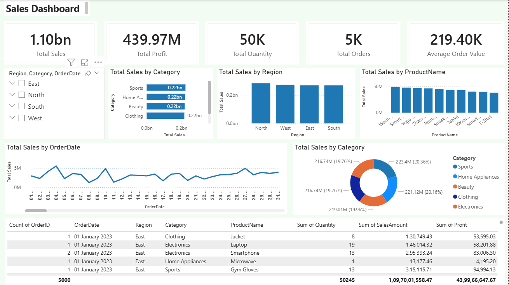

# Sales-Dashboard-PowerBI
Sales Dashboard – Power BI

This project presents a business-ready Power BI Sales Dashboard built using a 5,000-record sales dataset.
It includes interactive KPIs, trend analysis, regional insights, category performance, and product-level analytics — all designed for clear business storytelling and executive reporting.

🚀 Project Overview

The Sales Dashboard provides a complete overview of business performance using:

KPIs: Total Sales, Total Profit, Profit Margin, Quantity Sold, Total Orders, Average Order Value

Visuals: Category sales, monthly sales trend, region performance, top products, category share

Slicers: Year, Region, Category

Advanced features: Drill-down, conditional formatting, tooltips, Date table with DAX

Measure Table: Clean and organized DAX KPIs in a dedicated measure table

This dashboard is optimized for clarity, clean layout, and insight-driven decision making.

Dashboard Features
🔹 Executive-Level KPIs

Total Sales

Total Profit

Profit Margin (%)

Total Quantity Sold

Total Orders

Average Order Value (AOV)

These cards provide a quick financial snapshot for business leaders.

🔹 Key Visual Insights
1. Sales by Category (Bar Chart)

Shows which product categories contribute the most revenue.

2. Sales by Region (Column Chart)

Breakdown of sales performance across North, South, East, and West.

3. Monthly Sales Trend (Line Chart)

Visualizes how sales change month-to-month.

4. Top 10 Products (Bar Chart)

Highlights best-performing products based on sales.

5. Category Share (Donut Chart)

Shows category-level contribution to total sales.

6. Detailed Sales Table

Includes:
Order ID, Date, Region, Category, Product Name, Quantity, Sales, Profit.

🧠 DAX Measures Used
Core Measures
Total Sales = SUM ( Sales[SalesAmount] )

Total Profit = SUM ( Sales[Profit] )

Total Quantity = SUM ( Sales[Quantity] )

Total Orders = DISTINCTCOUNT ( Sales[OrderID] )

Average Order Value = DIVIDE ( [Total Sales], [Total Orders] )

Profit Margin = DIVIDE ( [Total Profit], [Total Sales] )

Time Intelligence Measures

(Requires DimDate table)

Sales YTD = TOTALYTD ( [Total Sales], DimDate[Date] )

Sales Last Year = CALCULATE ( [Total Sales], DATEADD( DimDate[Date], -1, YEAR ) )

Sales YoY % =
DIVIDE( [Sales YTD] - [Sales Last Year], [Sales Last Year] )

🗂 Data Model

The model follows clean BI design:

Fact table: Sales

Dimension table: DimDate

Measure table: MeasureTable

Relationships:

DimDate[Date] → Sales[OrderDate]

🎨 Dashboard Styling & Theme

Colors Used:

Primary Blue: #1F77B4

Secondary Teal: #17BECF

Profit Green: #2CA02C

Loss Red: #D62728

Background Grey: #F2F2F2

Text Dark Grey: #333333

This ensures a clean, professional corporate look.

📸 Dashboard Preview

Add your dashboard in the output/ folder and reference like:

